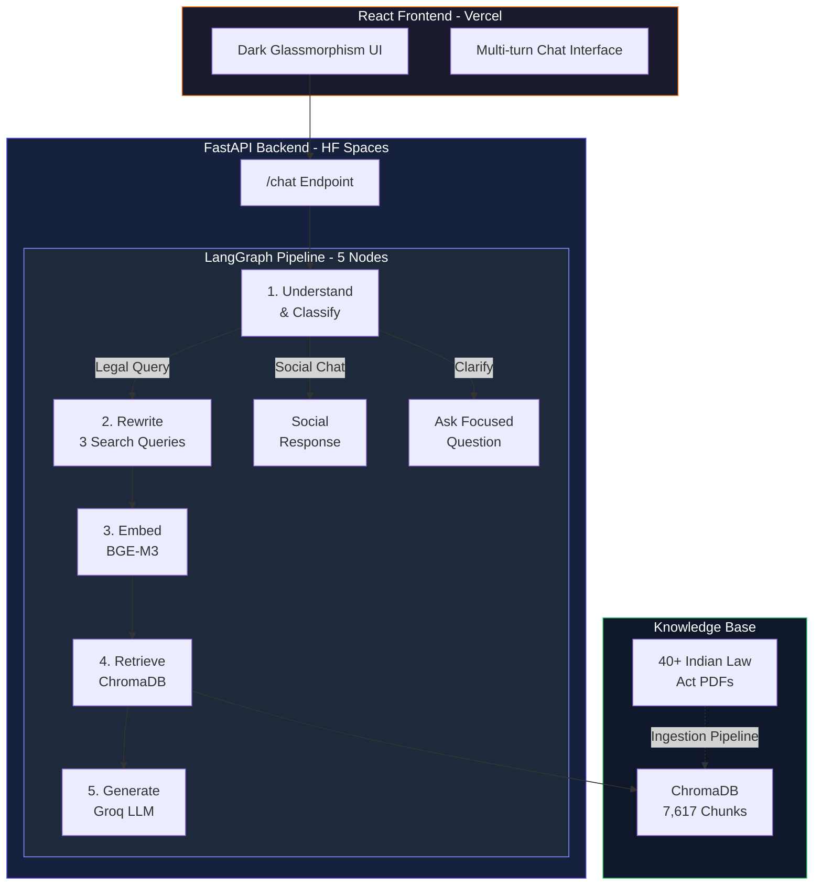

<div align="center">

# Sakhi -- AI Legal Companion for India

**Making Indian law accessible to everyone -- in simple words, without judgment.**

[](https://sakhi-alpha.vercel.app)
[](https://huggingface.co/spaces/Hush04/sakhi-api)
[](https://python.org)
[](https://react.dev)
[](LICENSE)

</div>

---

## What is Sakhi?

Most Indians have **never spoken to a lawyer**. When legal trouble hits -- a wrongful police encounter, a harassment complaint, a landlord dispute -- they turn to Google and get buried in confusing legal jargon.

**Sakhi** is an AI-powered legal companion that understands your situation in plain language (English, Hindi, or Hinglish) and explains exactly what Indian law says -- citing specific Acts and Sections -- like a knowledgeable friend sitting with you over chai.

### Key Features

| Feature                         | Description                                                                   |
| ------------------------------- | ----------------------------------------------------------------------------- |
| **Multi-turn Conversations**    | Sakhi remembers your entire conversation and builds context                   |
| **40+ Indian Law Acts**         | Covers criminal law (BNS), civil, family, labour, tax, IT, and more           |
| **RAG Pipeline**                | Retrieves actual legal sections from a 7,600+ chunk vector database           |
| **Hinglish Support**            | Understands "FIR dala", "meri salary nahi mili", and Indian slang             |
| **Empathetic & Non-judgmental** | Validates feelings first, explains law second, gives action steps third       |
| **Smart Clarifications**        | Asks max 2 focused questions, then answers with whatever context it has       |
| **Sensitive Topic Handling**    | POCSO, domestic violence, police rights -- explained with care, never refused |

---

## Architecture



---

## Tech Stack

| Layer             | Technology                       | Purpose                                      |
| ----------------- | -------------------------------- | -------------------------------------------- |
| **LLM**           | Groq (`llama-3.3-70b-versatile`) | Fast inference for legal reasoning           |
| **Embeddings**    | BGE-M3 (`BAAI/bge-m3`)           | State-of-the-art multilingual embeddings     |
| **Vector DB**     | ChromaDB                         | Stores 7,617 law chunks with semantic search |
| **Orchestration** | LangGraph + LangChain            | 5-node stateful RAG pipeline                 |
| **API**           | FastAPI + Uvicorn                | Async REST API with CORS                     |
| **Frontend**      | React 19 + Vite + Tailwind CSS 4 | Dark glassmorphism chat interface            |
| **Animations**    | Framer Motion                    | Smooth micro-interactions                    |
| **Observability** | LangSmith (optional)             | Trace and debug pipeline runs                |
| **Deployment**    | Vercel (FE) + HF Spaces (BE)     | Free-tier cloud hosting                      |

---

## Legal Knowledge Base

Sakhi's vector database contains **40+ Indian law PDFs** covering:

| Category                   | Acts Included                                                                                                                       |
| -------------------------- | ----------------------------------------------------------------------------------------------------------------------------------- |
| **New Criminal Framework** | Bharatiya Nyaya Sanhita (BNS) 2023, Bharatiya Nagarik Suraksha Sanhita (BNSS), Bharatiya Sakshya Adhiniyam                          |
| **Core Civil Laws**        | Indian Contract Act 1872, Code of Civil Procedure 1908, Transfer of Property Act, Limitation Act, Specific Relief Act               |
| **Personal & Family Laws** | Hindu Marriage Act, Hindu Succession Act, Special Marriage Act, Muslim Personal Law, Domestic Violence Act, Guardians and Wards Act |
| **Labour Codes**           | Code on Wages, Industrial Relations Code, Social Security Code, Occupational Safety Code                                            |
| **Commercial Laws**        | Companies Act 2013, Insolvency and Bankruptcy Code, Partnership Act, Sale of Goods Act, Negotiable Instruments Act, LLP Act         |
| **Tax & Financial**        | Income Tax Act 1961, GST Act 2017, FEMA, Prevention of Money Laundering Act                                                         |
| **Special & Regulatory**   | Consumer Protection Act 2019, IT Act 2000, RTI Act, Motor Vehicles Act, Environmental Laws, Arbitration Act                         |
| **Constitution**           | Constitution of India (Fundamental Rights, DPSPs, and more)                                                                         |

---

## Getting Started

### Prerequisites

- **Python 3.11+**
- **Node.js 18+**
- **Groq API Key** (free at [console.groq.com](https://console.groq.com))

### 1. Clone & Setup Backend

```bash
git clone https://github.com/AbhiGupta1310/Sakhi.git
cd Sakhi

# Create virtual environment
python -m venv .venv
source .venv/bin/activate  # Windows: .venv\Scripts\activate

# Install dependencies
pip install -r requirements.txt

# Set your API key
echo "GROQ_API_KEY=your_key_here" > .env
```

### 2. Setup Frontend

```bash
cd sakhi-ui
npm install
cd ..
```

### 3. Run Everything

```bash
# Option A: Use the automated script
chmod +x run_app.sh
./run_app.sh

# Option B: Manual start
# Terminal 1 -- Backend
python -m src.api.main

# Terminal 2 -- Frontend
cd sakhi-ui && npm run dev
```

Open **http://localhost:5173** and start chatting!

---

## RAG Pipeline Details

Sakhi uses a **5-node LangGraph pipeline** with intelligent routing:

### Node 1: Understand & Classify

- Parses user query, fixes typos/Hinglish
- Classifies as `legal_query` or `social_chat`
- Decides if clarification is needed (max 2 questions)
- Routes: `social` -> friendly response | `clarify` -> ask question | `rewrite` -> full RAG

### Node 2: Rewrite Queries

- Generates **3 diverse search queries** from the understood question:
  - Legal terminology angle
  - Plain language angle
  - Specific Act/Section angle

### Node 3: Embed

- Embeds all 3 queries using **BGE-M3** (`BAAI/bge-m3`)
- Multilingual -- handles English, Hindi, and Hinglish natively

### Node 4: Retrieve & Score

- Queries ChromaDB with `top_k=8`
- Deduplicates across all query results
- Filters by `relevance_threshold=0.55`
- Caps at `max_context_chunks=6` for the LLM

### Node 5: Generate Answer

- Uses **Groq** (`llama-3.3-70b-versatile`) with the full system prompt
- Includes conversation history for multi-turn context
- Falls back to `llama-3.1-8b-instant` on rate limits
- Low-confidence path: honest "I don't have this exact section" + referral

---

## Deployment

| Component    | Platform            | URL                                                                         |
| ------------ | ------------------- | --------------------------------------------------------------------------- |
| **Frontend** | Vercel              | [sakhi-alpha.vercel.app](https://sakhi-alpha.vercel.app)                    |
| **Backend**  | Hugging Face Spaces | [hush04-sakhi-api.hf.space](https://huggingface.co/spaces/Hush04/sakhi-api) |

### Deploy Your Own

```bash
# Frontend -> Vercel
# Set env: VITE_API_URL = https://your-backend-url

# Backend -> HF Spaces (Docker)
# Set secret: GROQ_API_KEY = your_key
# Uses the included Dockerfile
```

---

## Project Structure

```
Sakhi/
├── src/
│   ├── api/
│   │   └── main.py              # FastAPI server (/chat, /health)
│   ├── core/
│   │   └── rag.py               # 5-node LangGraph RAG pipeline
│   ├── config.py                # All configuration + system prompt
│   ├── ingest/
│   │   ├── loader.py            # PDF -> text extraction (PyMuPDF)
│   │   ├── embedder.py          # BGE-M3 embedding generation
│   │   ├── chroma_store.py      # ChromaDB storage
│   │   ├── pipeline.py          # End-to-end ingestion orchestrator
│   │   ├── ingest_cli.py        # CLI for running ingestion
│   │   └── query.py             # Query testing utility
│   └── utils/
│       └── logging_utils.py     # Centralized logging
├── sakhi-ui/
│   └── src/
│       ├── App.tsx              # React chat interface
│       └── index.css            # Dark glassmorphism theme
├── data/
│   ├── pdfs/                    # 40+ Indian law PDFs (8 categories)
│   ├── txt/                     # Extracted text files
│   ├── processed/               # Embeddings cache
│   └── chroma_db/               # Vector database (7,617 chunks)
├── Dockerfile                   # Docker config for HF Spaces
├── run_app.sh                   # Automated startup script
├── requirements.txt             # Python dependencies
└── .env                         # API keys (not committed)
```

---

## Contributing

Contributions are welcome! Areas where help is especially appreciated:

- **Adding more law PDFs** -- State-specific laws, recent amendments
- **Hindi/regional language UI** -- Translating the interface
- **Test cases** -- Legal scenario test suites
- **UI/UX improvements** -- Mobile responsiveness, accessibility

---

## Disclaimer

Sakhi is an **AI-powered legal education tool**. It provides general legal information based on Indian law to help you understand your rights. It is **NOT** a substitute for professional legal advice. For serious legal matters, always consult a qualified lawyer or contact your nearest **District Legal Services Authority** for free legal aid.

**Emergency Resources:**

- Police Emergency: **112**
- Women Helpline: **181**
- National Commission for Women: **7827-170-170**
- Cyber Crime: **cybercrime.gov.in**
- Free Legal Aid: **NALSA** (available in every district)

---

<div align="center">

**Built with care for India**

_Because everyone deserves to understand the law that protects them._

</div>
